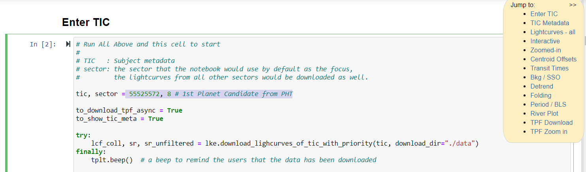

# TIC Vetting Walkthrough

A walkthrough of some of the features of the notebook, and how it can be used to identify some of the common false positives.
The walkthrough primarily uses [TIC 55525572 / TOI 813.01](https://exofop.ipac.caltech.edu/tess/target.php?id=55525572), the first planet candidate from Planet Hunters TESS, as the example.

- Enter the `TIC`, `sector` in the "Enter TIC" section.
    - a side navigation to quickly jump to various sections.

- Plot TIC's lightcurves across sectors

- Interactively zoom in to a potential transit.

- Plot the zoomed in transit
    - you'd need to specify `transit_specs`. The interactive plot above produces a sample one that you can copy/paste.
    - The `transit_specs` is also used as the default for most subsequent sections, in addition to plots here.

- Visualize the transit times across sectors
    - to see if the candidate `epoch` + `period` matches observation.

- Interactively inspect the lightcurve at per-pixel level around the dip.
    - the TIC is usually around the brightest pixel at the center of aperture pixels(outlined in white).
    - Aperture pixels: the pixels which are the primary contributors to the "official" lightcurves (on MAST, Planet Hunters TESS, etc.)

- Visualize flux changes at per-pixel level.
    - helpful to identify when the dips are centered off target.
    - In this specific case, the changes are so small that it is not helpful.

---

- Example where per-pixel plot shows dips were off target. The following is from [TIC 441058522](https://exofop.ipac.caltech.edu/tess/target.php?id=441058522), sector 36:

- Overlay with the Skyview, you can find potential contamination sources:
    - in this case, a candidate (around the center of the dip) would be TIC 441067223, pointed by red arrow below.
    - For this TIC, one can draw the same conclusion from the centroid offset diagnostics in its [TCE](https://exo.mast.stsci.edu/exomast_planet.html?planet=TIC441058522S0036S0036TCE1) vetting report summary. But not every dips you encounter have a TCE.

- Per-pixel plot can help to visualize other kinds of problems too. E.g., an asteroid passed through the field. Consider the following dip from TIC 38085803:

- Per-pixel plot showed the dip is due to an asteroid passing through:

