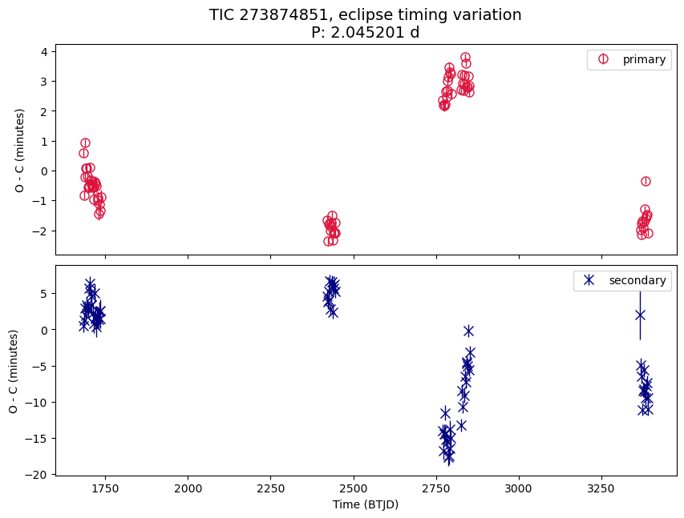

<!--
regex for images
^!(.+)$

-->

# Identifying Multi Star System Candidates using VSX, Gaia DR3 NSS and TESS

## Results

- Identified 51 targets of which the orbital period from eclipses (VSX / TESS) is different from the period from spectroscopy (Gaia DR3 NSS)
- ETV analysis was attempted for the targets. The breakdown:

| Disposition                               | Num. of TICs |
| ----------------------------------------- | ------------ |
| Y: Strong signs of nonlinear trend in ETV | 6            |
| Y?: Might be nonlinear trend in ETV       | 10           |
| ?: Uncertain ETV results                  | 22           |
| N?: Most likely no ETV                    | 4            |
| Skip: insufficient TESS data for ETV      | 9            |

See methods section on how these candidates are selected and how ETV analysis was carried out.

### Candidates with strong signs of nonlinear trend in ETV

Those with `has_etv = Y` in candidates table.

#### TIC 353894978

EB to SB Period ~ 1:3 . O-C period: possibly ~141 days, ~184 days

#### TIC 30034081

EB to SB Period ~ 2.8:1 . O-C period: no clear one.

#### TIC 154453805

EB : SB Period ~ 1:3.07 . O-C period: possibly 1000+ days or ~215 days.

#### TIC 290035575

EB : SB Period ~= 9:10 . O-C period: ~7.6 days

It is worth noting that the orbital period from eclipses is ~0.95 day, SB Period ~1.05 day, and O-C period is ~7.6 days.

The periodic ETV variation is visible in a phase plot of the O-C:

#### TIC 410354930

EB : SB Period ~= 1.7 : 1 . O-C Period: unclear.

#### TIC 167304040

EB : SB Period ~= 7.1 : 1 . O-C Period: unclear.

### Samples of other candidates

#### TIC 38383256

`has_etv = Y?`. Anti-correlated timings: The trend of primary is opposite of the one of secondary. Possibly long term non-linear trend as well.

  

#### TIC 36883123

`has_etv = Y?`. Anti-correlated timings: The trend of primary is opposite of the one of secondary.
No clear long-term non-linear trend (a small possibility of a ~14 d period). Only 2 sectors of data.

Other targets with anti-correlated timings, but have no clear long-term non-linear trend (possibly due to lack of data)
TIC 57297550 (possibly O-C period of ~21 d), TIC 440051305, TIC 11546041

 

#### TIC 52368472

`has_etv = Y?`. Unsure if the trend is non-linear.

  

#### TIC 231922417

`has_etv = Y?`. Apparent non-linear trend. Huge error in O-C, especially in the 30 minute cadence data in the early sectors.

 

#### TIC 273874851

`has_etv = Y?`. Possibly long-term (1000d+) non-linear trend.

  

---

## Possible Future Work

---

## Methods

### Candidate Selection

- Cross matched 3485 TICs [*] known to be an EB in VSX, with Gaia DR3 NSS SB type.
- 515 TICs are SBs per Gaia DR3.
- 65 TICs: period from eclipses in VSX is different from the period from spectroscopy in Gaia DR3 NSS or aliases.
    - the periods are considered the same if the ratio of VSX Period to SB Period are in [0.99, 1.01], [0.495, 0.505], or [1.98, 2.02].
- 51 TICs: period from eclipses are indeed different from the period from spectroscopy after inspecting data in TESS.
    - 14 are deemed false positives. Most of them are because the period in VSX are not accurate.

- [*] The initial 3485 TICs come from TICs tagged as eclipsing binary by the volunteers of [Zooniverse Planet Hunters TESS](https://www.zooniverse.org/projects/nora-dot-eisner/planet-hunters-tess/talk/tags/eclipsingbinary) that are also known EB in VSX. The choice is primarily a matter of expedience. The dataset can be seen as a sample of known EB in VSX which also has some TESS data in 2-minute cadence.

### Eclipse Timing Variations (ETV) Analysis

- ETV analysis has been carried out for the 51 TICs based on their TESS data.
    - The TESS data used are based on 2-minute cadence data provided by SPOC, supplemented with 10-minute / 30-minute cadence data from TESS-SPOC or QLP in sectors where 2-minute cadence data is not available.
- Eclipse midpoint ephemeris is identified by fitting a geometric `cosh` Gaussian model to individual eclipses with [`emcee`](https://emcee.readthedocs.io/), using a custom version of [`https://github.com/noraeisner/ETVs`](https://github.com/noraeisner/ETVs) .
    - The initial eclipse midpoint and period are determined using a variety of means,including consulting the values from VSX and TESS TCEs, manual fitting, and MCMC-based fitting of a geometric `cosh` Gaussian model with period as an additional free parameter.
    - In most cases, the model fitting is done on the central portion of eclipses, excluding ingress/egress, as fitting on ingress/egress tends to be less accurate, and is not essential for the purpose of determining eclipse midpoints.
    - For cases the underlying TESS data are 30 minute cadence and eclipse duration is short, the modeled midpoints often have large errors (or are altogether excluded) because of limited number of data points per eclipse. For example, an eclipse with 4 hour duration would imply at most 8 data points in 30 minute cadence data.

---

## TODOs

