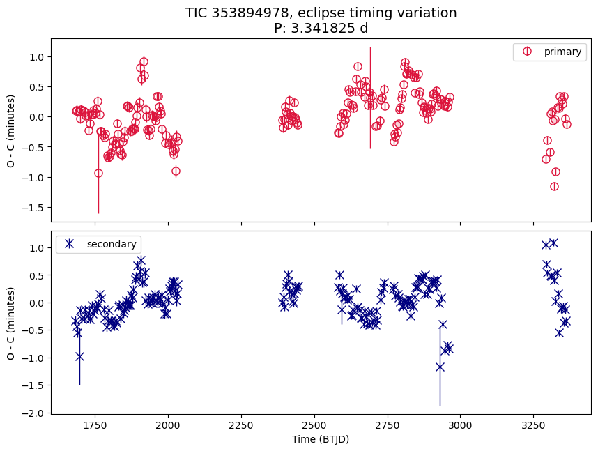

# Identifying Multi Star System Candidates using VSX, Gaia DR3 NSS and TESS

## Results

- Identified 51 targets of which the orbital period from eclipses (VSX / TESS) is different from the period from spectroscopy (Gaia DR3 NSS)
- ETV analysis was attempted for the targets. The breakdown:

| Disposition                               | Num. of TICs |
| ----------------------------------------- | ------------ |
| Y: Strong signs of nonlinear trend in ETV | 6            |
| Y?: Might be nonlinear trend in ETV       | 10           |
| ?: Uncertain ETV results                  | 22           |
| N?: Most likely no ETV                    | 4            |
| Skip: insufficient TESS data for ETV      | 9            |

See methods section on how these candidates are selected and how ETV analysis was carried out.

### Candidates with strong signs of nonlinear trend in ETV

#### TIC 353894978

EB to SB Period ~ 1:3 . O-C period: possibly ~141 days, ~184 days

#### TIC 30034081

EB to SB Period ~ 2.8:1 . O-C period: no clear one.

#### TIC 154453805

EB : SB Period ~ 1:3.07 . O-C period: possibly 1000+ days.

#### TIC 290035575

EB : SB Period ~= 9:10 . O-C period: ~7.6 days

The periodic ETV variation is visible in a phase plot of the O-C:

#### TIC 410354930

EB : SB Period ~= 1.7 : 1 . O-C Period: unclear.

#### TIC 167304040

EB : SB Period ~= 7.1 : 1 . O-C Period: unclear.

### Samples of other candidates

---

## Possible Future Work

---

## Methods

### Candidate Selection

- Cross matched 3485 TICs known to be an EB in VSX, with Gaia DR3 NSS SB type.
- 515 TICs are SBs per Gaia DR3.
- 65 TICs: period from eclipses in VSX is different from the period from spectroscopy in Gaia DR3 NSS or aliases.
    - the periods are considered the same if the ratio of VSX Period to SB Period are in [0.99, 1.01], [0.495, 0.505], [1.98, 2.02].
- 51 TICs: period from eclipses are indeed different from the period from spectroscopy after inspecting data in TESS.
    - 14 are deemed false positives. Most of them are because the period in VSX are not accurate.

- TODO: how the initial 3485 TICs are selected.

---

## TODOs

- Change Y: to Y? for 52368472
